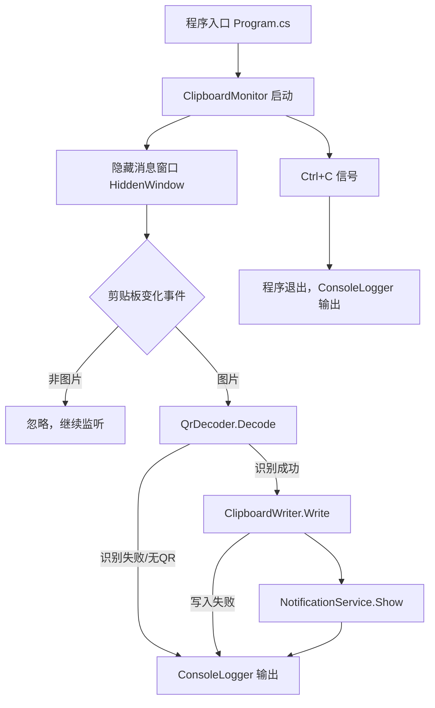

# 技术设计文档：Clipboard QR Code Reader

## 概述

本程序是一个持续运行的 Windows 桌面控制台应用，使用 C# (.NET) 实现。程序通过 Windows 消息钩子或轮询机制监听系统剪贴板变化，当检测到图片类型内容时，调用 ZXing.NET 库进行 QR Code 识别。识别成功后，通过 Windows Toast 通知 API 弹出系统通知，并将识别结果以纯文本写回剪贴板；识别失败或非 QR Code 图片则仅输出带时间戳的控制台日志。

### 技术选型

- **运行时**：.NET 8（Windows-only）
- **QR Code 识别**：ZXing.NET（NuGet: `ZXing.Net`）
- **系统通知**：Windows Community Toolkit（`Microsoft.Toolkit.Uwp.Notifications` 或 `Microsoft.Windows.SDK.Contracts`）
- **剪贴板访问**：`System.Windows.Forms.Clipboard`（需 STA 线程）
- **剪贴板监听**：Win32 `AddClipboardFormatListener` + WinForms 消息窗口，或轮询备选方案

---

## 架构

程序采用单进程、多线程架构，主要分为消息循环线程（STA）和后台处理逻辑。



### 线程模型

- **主线程（STA）**：运行 WinForms 消息循环，用于接收 `WM_CLIPBOARDUPDATE` 消息和操作剪贴板（剪贴板 API 要求 STA）。
- **处理逻辑**：在消息回调中同步执行 QR 识别和写回，避免多线程竞争剪贴板。

---

## 组件与接口

### 1. ClipboardMonitor

负责注册剪贴板监听、接收变化通知，并协调各模块。

```csharp
public class ClipboardMonitor : IDisposable
{
    public void Start();   // 注册 Win32 监听，启动消息循环
    public void Stop();    // 注销监听，退出消息循环
    private void OnClipboardChanged(); // 内部回调，驱动处理流程
}
```

### 2. QrDecoder

封装 ZXing.NET，负责从 Bitmap 中识别 QR Code。

```csharp
public class QrDecoder
{
    // 返回识别结果；text 为 null 表示未找到 QR Code
    public QrDecodeResult Decode(Bitmap image);
}

public record QrDecodeResult(
    bool Success,
    string? Text,
    string? ErrorMessage
);
```

### 3. NotificationService

封装 Windows Toast 通知。

```csharp
public class NotificationService
{
    public void Show(string title, string body);
    private string Truncate(string text, int maxLength); // 超长截断
}
```

### 4. ClipboardWriter

将文本写回剪贴板（STA 线程执行）。

```csharp
public class ClipboardWriter
{
    // 返回是否写入成功
    public bool Write(string text);
}
```

### 5. ConsoleLogger

带时间戳的控制台输出。

```csharp
public static class ConsoleLogger
{
    public static void Log(string message);
    // 内部格式：[YYYY-MM-DD HH:mm:ss] message
}
```

### 6. Program（入口）

- 初始化各模块
- 注册 `Console.CancelKeyPress` 处理 Ctrl+C
- 启动 `ClipboardMonitor`
- 阻塞主线程直至退出信号

---

## 数据模型

### QrDecodeResult

```csharp
public record QrDecodeResult(
    bool Success,        // true = 识别到 QR Code
    string? Text,        // 识别出的文本（Success=true 时非空）
    string? ErrorMessage // 错误描述（Success=false 时可选）
);
```

### 通知显示约束

| 字段 | Windows Toast 上限 | 截断策略 |
|------|-------------------|----------|
| 标题 | ~64 字符 | 固定为「已识别 QR Code」，不需截断 |
| 正文 | ~200 字符 | 超出则截断并追加 `…` |

### 日志格式

```
[2024-01-15 14:30:25] 程序已启动，正在监听剪贴板...
[2024-01-15 14:30:31] 图片中未发现 QR Code。
[2024-01-15 14:30:45] QR Code 识别失败：解码错误（FormatException）。
[2024-01-15 14:31:02] 程序已停止。
```

---

## 正确性属性

*属性（Property）是在系统所有合法执行路径中都应成立的特征或行为——本质上是对系统应该做什么的形式化描述。属性是连接人类可读规约与可机器验证的正确性保证之间的桥梁。*

### 属性 1：剪贴板图片传递完整性

*对任意* 放入剪贴板的 Bitmap 图片，ClipboardMonitor 读取后传递给 QrDecoder 的图片数据，其像素内容应与原始剪贴板图片一致。

**验证需求：需求 2.1、2.2**

### 属性 2：QR Code 识别轮回（Round Trip）

*对任意* 合法的文本字符串，将其编码为 QR Code 图片后再由 QrDecoder 解码，得到的文本应与原始字符串相等。

**验证需求：需求 3.1、3.2**

### 属性 3：无 QR Code 图片返回失败状态

*对任意* 不包含 QR Code 的图片（纯色、自然图片等），QrDecoder.Decode 的返回值中 Success 应为 false，Text 应为 null。

**验证需求：需求 3.3**

### 属性 4：通知正文截断不变式

*对任意* 文本字符串，NotificationService 显示时若文本长度超过上限 N，则通知正文长度 ≤ N 且以 `…` 结尾；若文本长度 ≤ N，则通知正文与原始文本相等。

**验证需求：需求 4.4**

### 属性 5：剪贴板写入轮回（Round Trip）

*对任意* 文本字符串，调用 ClipboardWriter.Write(text) 成功后，立即读取剪贴板中的纯文本内容，应与写入的文本完全相同。

**验证需求：需求 5.1**

### 属性 6：日志时间戳格式不变式

*对任意* ConsoleLogger.Log 调用，输出字符串的前 21 个字符应匹配格式 `[YYYY-MM-DD HH:mm:ss]`，且其中的日期时间值应为合法时间。

**验证需求：需求 6.3**

### 属性 7：写入失败不阻断通知

*对任意* ClipboardWriter.Write 抛出异常或返回失败的情况，NotificationService.Show 仍应被调用一次（通知正常弹出）。

**验证需求：需求 5.3**

---

## 错误处理

| 场景 | 处理方式 |
|------|----------|
| 剪贴板读取异常（`ExternalException`）| 捕获，ConsoleLogger 输出，继续监听 |
| QR 解码异常（`Exception`）| 捕获，QrDecodeResult(false, null, ex.Message) |
| 剪贴板写入失败（`ExternalException`）| 捕获，ConsoleLogger 输出，不影响通知弹出 |
| Toast 通知 API 不可用 | 捕获，ConsoleLogger 输出降级提示 |
| 消息循环意外退出 | 顶层 try-catch，ConsoleLogger 输出，程序退出 |

所有异常均不应导致程序崩溃；顶层应有全局异常处理保底。

---

## 测试策略

### 双轨测试方法

**单元测试**（xUnit）：验证具体示例、边界条件和错误场景。
**属性测试**（FsCheck，NuGet: `FsCheck.Xunit`）：对上述正确性属性进行随机输入验证，每个属性测试至少运行 100 次。

### 单元测试重点

- QrDecoder：已知含/不含 QR Code 的固定图片
- NotificationService.Truncate：空字符串、恰好等于上限、超出上限的字符串
- ConsoleLogger：时间戳格式正确性
- ClipboardWriter：模拟剪贴板写入成功与失败

### 属性测试配置

每个属性测试用 `[Property]` 标注，并以注释注明对应设计属性：

```csharp
// Feature: clipboard-qrcode-reader, Property 4: 通知正文截断不变式
[Property(MaxTest = 100)]
public Property NotificationBodyTruncation(string text) { ... }
```

| 设计属性 | 测试类型 | 说明 |
|----------|----------|------|
| 属性 1 | 属性测试 | 生成随机 Bitmap，验证像素一致性 |
| 属性 2 | 属性测试 | 生成随机文本 → 编码 → 解码 |
| 属性 3 | 属性测试 | 生成随机非 QR 图片，验证返回失败 |
| 属性 4 | 属性测试 | 生成随机长度字符串，验证截断逻辑 |
| 属性 5 | 属性测试 | 生成随机文本，验证写入读回一致 |
| 属性 6 | 属性测试 | 生成随机日志消息，验证时间戳格式 |
| 属性 7 | 单元测试 | 模拟写入失败，断言通知仍被调用 |

### 不可自动化测试的场景

- Ctrl+C
 退出后控制台输出（UI 行为）
- Toast 通知的视觉样式（UI 感知）
- 程序启动时的控制台显示效果（UI 感知）
